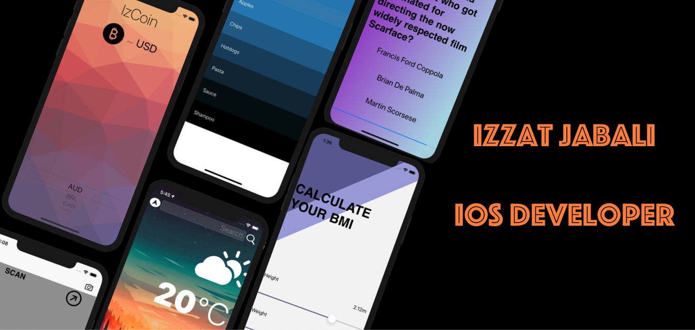

### Hey, I’m Izzy. 
## My mission is to create apps that make people's lives better and easier.
### I’m a self-taught, self motivated and best practice-driven iOS developer with a handful of developed applications. I'm dedicated to continuously discovering, evaluating, and implementing new technologies to maximise development efficiency.

<!-- Actual text -->
### Twitter & LinkedIn - [![Twitter][1.2]][1] [![LinkedIn][2.2]][2].

<!-- Icons -->

[1.2]: http://i.imgur.com/wWzX9uB.png (twitter icon without padding)
[2.2]: https://raw.githubusercontent.com/MartinHeinz/MartinHeinz/master/linkedin-3-16.png (LinkedIn icon without padding)

<!-- Links to your social media accounts -->

[1]: https://twitter.com/izzzyzz
[2]: https://www.linkedin.com/in/izzat-jabali/

